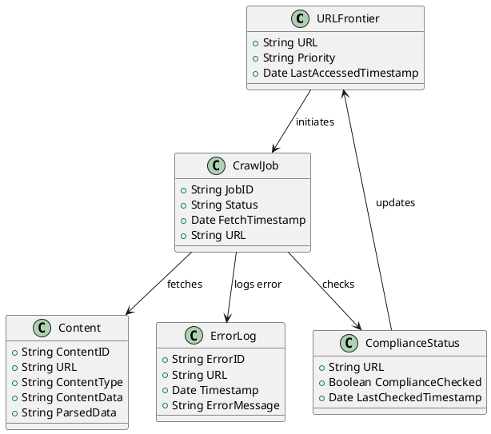
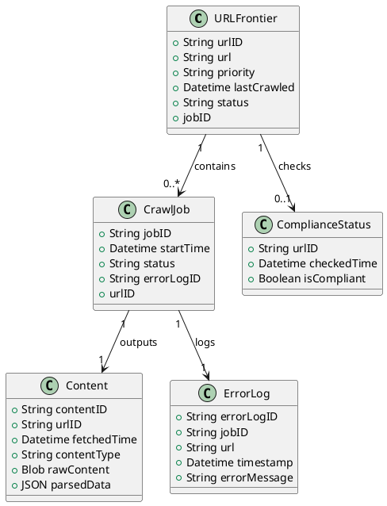

## Functional Requirements

1. **Target Websites or Domains:** The web crawler should be configured to target specific websites or domains as specified by the user. An option to crawl any site on the internet should also be available for more general use cases.

2. **Handling Different Content Types:** The web crawler must be able to handle various types of content, including images, videos, and documents (PDFs, Word files, etc.). It should have the capability to download and store these contents or extract relevant metadata as specified by the configuration.

3. **Dynamic Content:** For dynamic content generated by JavaScript, the web crawler should be equipped with a headless browser or a similar technology to accurately render and extract such content. This ensures that all information on the page can be captured.

4. **Revisit Frequency:** The web crawler should revisit the same websites at configurable intervals. This could be set to daily, weekly, or according to the user's specific needs and the nature of the website's content updates.

## Non-Functional Requirements

1. **Performance and Speed:** The web crawler should prioritize a balance between speed and comprehensiveness. It should be capable of quickly crawling sites while also ensuring thoroughness in capturing data.

2. **Scalability:** The web crawler must be scalable to handle an increasing number of web pages over time. This involves optimizing the architecture to support distributed crawling and parallel processing.

3. **Security and Compliance:** The web crawler must adhere to standard security practices and compliance requirements, such as respecting `robots.txt` files, handling user data responsibly, and complying with data protection regulations like GDPR.

4. **Error Management:** Errors and exceptions should be systematically logged and reported. The web crawler should have robust error-handling mechanisms to recover from issues without interrupting the crawling process. Additionally, it should provide detailed logs for troubleshooting and audit purposes.
# Web Crawler Design Document

## Functional Requirements Analysis

1. **Target Sites:** Specify list of domains or all internet sites. For this estimate, assume crawling all internet sites.
2. **Content Handling:** Crawl and download all data types - HTML, images, videos, documents.
3. **Dynamic Content:** Use headless browsers (e.g., Puppeteer) to handle JavaScript.
4. **Revisit Frequency:** Assume revisiting each site weekly.

## Non-Functional Requirements Analysis

1. **Performance:** Prioritize comprehensiveness over speed; target 1,000 pages per minute.
2. **Scalability:** Initial capacity to handle 10 million pages, scalable by 5% month-over-month.
3. **Security/Compliance:** Follow robots.txt, SSL/TLS, and data privacy regulations.
4. **Error Management:** Comprehensive logging system, real-time alerts on critical failures.

## Capacity Estimates

1. **User Traffic (Network I/O):**
   - Average page size: 1 MB (includes HTML, images, etc.)
   - 1,000 pages/min x 1 MB = 1,000 MB/min = 1 GB/min
   - Network throughput: 1 GB/min x 1440 min/day = 1,440 GB/day (~1.44 TB/day)

2. **Storage (Disk space):**
   - Initial data for 10 million pages: 10M pages x 1 MB/page = 10 TB
   - 5% growth/month: Account for 6 months = 10 TB x (1 + 0.05)^6 ≈ 13.4 TB

3. **Memory (RAM):**
   - Estimate for concurrent processing: Assume 10 worker nodes, each handling 100 pages/min.
   - Each worker node: 4 GB RAM (heavy processing incl. headless browsing) = 10 nodes x 4 GB = 40 GB RAM

4. **Compute (CPU):**
   - 1 page load (with JS) ≈ 0.1 CPU seconds
   - 1,000 pages/min = 1,000 x 0.1 CPU sec = 100 CPU seconds/min ~ 17 CPU min/min
   - Assuming 10 nodes: each needs ~1.7 CPU cores (round to 2 cores)
   - Total: 10 nodes x 2 cores = 20 CPU cores

5. **Networking:**
   - Bandwidth: 1 GB/min; ensure high throughput networking infrastructure.

## Configurations

- **Cluster Setup:**
  - 10 worker nodes: Each provisioned with 2 vCPUs, 4 GB RAM, 2+ TB storage (local + distributed file system)
  - Central storage system (distributed, e.g., HDFS): 15 TB initial capacity, scalable

## Error Management & Logging

- Real-time monitoring (e.g., Prometheus), alerting (e.g., PagerDuty)
- Centralized log system (e.g., ELK stack), track all requests, responses, errors

## Security

- Ensure encrypted traffic (SSL/TLS)
- Follow robots.txt policies, compliance with data privacy laws (GDPR, CCPA)

## Summary

- **Network:** 1.44 TB/day bandwidth
- **Storage:** 13.4 TB disk (scalable)
- **Memory:** 40 GB RAM
- **Compute:** 20 vCPUs
- **Security:** SSL/TLS, robots.txt, compliance monitoring
- **Error Management:** Real-time monitoring/logging system

This provides a robust, scalable, and secure setup for the web crawler, handling current and future load.
# Web Crawler System Design Document

## High-Level Components

1. **URL Frontier:**
   - Stores URLs to be crawled.
   - Implements politeness by tracking when sites were last accessed.
  
2. **Fetcher:**
   - Retrieves web pages.
   - Handles retries and failures.
  
3. **Parser:**
   - Extracts URLs and content from fetched pages.
   - Handles different content types (HTML, images, videos, documents).
  
4. **Storage System:**
   - Stores raw web pages and extracted content.
   - Data Stores: NoSQL (e.g., MongoDB), Blob storage (e.g., AWS S3).
  
5. **Scheduler:**
   - Determines the next set of URLs to crawl.
   - Respects revisit policies (weekly).
  
6. **Indexer:**
   - Converts parsed data into a searchable index.
   - Full-text search engine (e.g., Elasticsearch).
  
7. **Centralized Logging and Monitoring:**
   - Logs errors, exceptions, and system metrics.
   - Real-time monitoring (Prometheus, Grafana).
   
8. **Headless Browser Manager:**
   - Manages headless browsers (e.g., Puppeteer) for dynamic content.
  
9. **Compliance Module:**
   - Ensures robots.txt and data privacy law adherence.
  
10. **Alerting System:**
    - Sends real-time alerts on critical failures (PagerDuty).

## PlantUML Diagram
```plantuml
@startuml

package "URL Management" {
    [URL Frontier]
    [Scheduler]
}

package "Crawling" {
    [Fetcher]
    [Headless Browser Manager]
}

package "Content Processing" {
    [Parser] 
    [Indexer]
}

package "Storage" {
    [Data Store]
    [Blob Storage]
}

package "Logging and Monitoring" {
    [Logger]
    [Monitoring System]
}

package "Compliance" {
    [Compliance Module]
}

package "Alerting" {
    [Alerting System]
}

// Relationships
[Scheduler] --> [URL Frontier] : Requests URLs
[URL Frontier] --> [Fetcher] : Sends URLs
[Fetcher] --> [Headless Browser Manager] : Requests dynamic content
[Headless Browser Manager] --> [Fetcher] : Returns content
[Fetcher] --> [Parser] : Sends fetched pages
[Parser] --> [Data Store] : Stores processed data
[Parser] --> [Blob Storage] : Stores raw content
[Data Store] --> [Indexer] : Sends parsed data
[Scheduler] --> [Compliance Module] : Ensures compliance
[Logger] --> [Monitoring System] : Logs and metrics
[Monitoring System] --> [Alerting System] : Alerts on issues
[Alerting System] --> [Ops Team] : Sends alerts

@enduml
```

## Explanation of Tradeoffs and Design Decisions:

1. **Content Handling:**
   - Using headless browsers increases accuracy for dynamic contents but adds overhead.
   - Decision: Trade off speed for comprehensiveness.

2. **Revisit Frequency:**
   - Weekly revisits cover moderate update frequency without overloading websites.

3. **Scalability and Initial Capacity:**
   - Initial setup handles 10 million pages, design allows for incremental growth.

4. **Performance:**
   - Emphasizes robustness and comprehensiveness over raw speed.

5. **Logging and Monitoring:**
   - Centralized logging and real-time monitoring ensure quick fault detection and correction.

6. **Compliance and Security:**
   - Strict adherence to robots.txt and data privacy laws to avoid legal issues.

This architecture ensures a comprehensive, scalable, and compliant web crawler system optimized for structured and dynamic content from multiple sites across the internet.
# Optimal Database Type:

For the web crawler system, use a combination of NoSQL and blob storage for their scalability and flexibility.

1. **NoSQL Database (e.g., MongoDB):** For storing structured content metadata and links.
2. **Blob Storage (e.g., AWS S3 or HDFS):** For storing raw web pages and extracted media files.

## High-Level Model Entities, Relationships, and Attributes

### Entities:

1. **URL Frontier:**
   - Attributes: URL, Priority, LastAccessedTimestamp.
   - Relationships: To `Crawl Job`.

2. **Crawl Job:**
   - Attributes: JobID, Status, FetchTimestamp, URL.
   - Relationships: To `URL Frontier`, `Content`.

3. **Content:**
   - Attributes: ContentID, URL, ContentType, ContentData, ParsedData.
   - Relationships: To `Crawl Job`.

4. **ErrorLog:**
   - Attributes: ErrorID, URL, Timestamp, ErrorMessage.

5. **ComplianceStatus:**
   - Attributes: URL, ComplianceChecked, LastCheckedTimestamp.

### PlantUML Diagram



## Optimization Strategies:

1. **Sharding (NoSQL Databases):**
   - Shard `URL Frontier` and `Content` collections by URL hostname for faster access and balanced load.

2. **Parallel Processing:**
   - Use a distributed queue system (e.g., Kafka) to manage `Crawl Jobs` and distribute across multiple nodes.

3. **Asynchronous Fetching:**
   - Implement asynchronous calls for web page fetching to increase throughput.

4. **Caching:**
   - Employ in-memory caching (e.g., Redis) for frequently accessed or pending URLs to quickly serve re-fetching requests.

5. **Batch Scheduling:**
   - Schedule `Crawl Jobs` in batches to optimize database writes and reduce contention.

6. **Content Deduplication:**
   - Store only unique content entries with deduplication checks to save storage space and processing time.

7. **Indexing and Full-Text Search:**
   - Use secondary indexes for frequent query fields and full-text search indexing for parsed data (e.g., Elasticsearch).

## Summary:
This database scheme ensures efficient data storage, scalability, and optimized access patterns suitable for a web crawler system handling dynamic and diverse web content. Implementing the aforementioned optimization strategies will further enhance performance and maintainability.
# Web Crawler Interface Design

Based on the provided functional and non-functional requirements, the web crawler system will need to interact with various components such as URL management, fetching, parsing, and storage. Below is a detailed design of APIs and event models using REST for managing the crawler's operations. 

## URL Management API

### 1. URL Frontier
- **API Endpoint**: `/api/url-frontier`
- **Methods**:
  - **POST**: Add URLs to crawl
  - **GET**: Retrieve URLs to crawl
  - **DELETE**: Remove completed or deprecated URLs

#### POST /api/url-frontier
```json
{
  "urls": ["http://example.com", "http://another-domain.com"],
  "priority": "high"
}
```

#### GET /api/url-frontier
```json
{
  "urls": ["http://example.com", "http://another-domain.com"],
  "count": 100
}
```

#### DELETE /api/url-frontier
```json
{
  "urls": ["http://example.com", "http://another-domain.com"]
}
```

## Fetcher API

### 2. Fetcher
- **API Endpoint**: `/api/fetcher`
- **Methods**:
  - **POST**: Start a new fetch job
  - **GET**: Retrieve fetch job status

#### POST /api/fetcher
```json
{
  "url": "http://example.com",
  "job_id": "unique-job-id"
}
```

#### GET /api/fetcher
```json
{
  "job_id": "unique-job-id"
}
```

## Parser API

### 3. Parser
- **API Endpoint**: `/api/parser`
- **Methods**:
  - **POST**: Parse fetched content
  - **GET**: Retrieve parsing results

#### POST /api/parser
```json
{
  "job_id": "unique-job-id",
  "content": "<html>...</html>"
}
```

#### GET /api/parser
```json
{
  "job_id": "unique-job-id"
}
```

## Storage API

### 4. Storage
- **API Endpoint**: `/api/storage`
- **Methods**:
  - **POST**: Store parsed data
  - **GET**: Retrieve stored data

#### POST /api/storage
```json
{
  "job_id": "unique-job-id",
  "url": "http://example.com",
  "content_type": "html",
  "content": "<html>...</html>",
  "parsed_data": {"title": "Example", "links": ["http://another-domain.com"]}
}
```

#### GET /api/storage
```json
{
  "job_id": "unique-job-id",
  "url": "http://example.com"
}
```

## Compliance API

### 5. Compliance Module
- **API Endpoint**: `/api/compliance`
- **Methods**:
  - **POST**: Check compliance for a URL

#### POST /api/compliance
```json
{
  "url": "http://example.com"
}
```

## Error Handling and Logging

### 6. Error Logging
- **API Endpoint**: `/api/logger`
- **Methods**:
  - **POST**: Log errors

#### POST /api/logger
```json
{
  "job_id": "unique-job-id",
  "url": "http://example.com",
  "error_message": "Timeout error",
  "timestamp": "2023-01-01T00:00:00Z"
}
```

## Event Models

The system should use event-driven architecture with message queues (e.g. Apache Kafka, RabbitMQ) to handle the interactions between the components asynchronously.

### Event Flow

1. **URL Frontier to Fetcher**
   - Event: `new_url_to_crawl`
   - Payload:
     ```json
     {
       "urls": ["http://example.com"],
       "priority": "high"
     }
     ```

2. **Fetcher to Parser**
   - Event: `fetch_completed`
   - Payload:
     ```json
     {
       "job_id": "unique-job-id",
       "url": "http://example.com",
       "content": "<html>...</html>"
     }
     ```

3. **Parser to Storage**
   - Event: `parsing_completed`
   - Payload:
     ```json
     {
       "job_id": "unique-job-id",
       "url": "http://example.com",
       "parsed_data": {
         "title": "Example",
         "links": ["http://another-domain.com"]
       }
     }
     ```

4. **Error Handling**
   - Event: `error_occurred`
   - Payload:
     ```json
     {
       "job_id": "unique-job-id",
       "url": "http://example.com",
       "error_message": "Timeout error",
       "timestamp": "2023-01-01T00:00:00Z"
     }
     ```

### Summary

This comprehensive design using RESTful APIs and event models ensures efficient and scalable interactions within the web crawler system. Each component handles its specific task while communicating asynchronously to maintain high throughput and flexibility. The focus on detailed logging and compliance ensures robustness and adherence to regulations.### Scalability, Performance, and Latency Strategies

#### **Scalability Strategies:**

1. **Horizontal Scaling:**
 - **Load Balancers:** Distribute traffic across multiple servers.
 - **Microservices:** Break the system into independent services that can be scaled individually.

2. **Elastic Scaling:**
 - **Auto-scaling Groups:** Automatically scale resources up or down based on demand (e.g., AWS Auto Scaling).

3. **Distributed Databases:**
 - **Sharding:** Distribute large datasets across multiple databases (e.g., MongoDB sharding).
 - **Replication:** Ensure data availability and reliability through replication mechanisms.

4. **Queue Systems:**
 - **Message Queues:** Manage load asynchronously with queue systems like Apache Kafka or RabbitMQ.

#### **Performance Strategies:**

1. **Caching:**
 - **In-memory Caches:** Use Redis or Memcached to store frequently accessed data.
 - **CDNs:** Utilize content delivery networks to cache static content closer to users.

2. **Optimized Algorithms:**
 - **Efficient Parsing:** Use parsing libraries that are optimized for speed and memory.
 - **Batch Processing:** Process large datasets in batches to minimize overhead.

3. **Asynchronous Processing:**
 - **Non-blocking I/O:** Use asynchronous APIs to prevent blocking of threads, improving concurrency.
 - **Future/Promise:** Enable asynchronous task execution to manage multiple tasks concurrently.

#### **Latency Strategies:**

1. **Edge Computing:**
 - **Local Processing:** Perform computations closer to the data source to reduce latency (e.g., AWS Lambda@Edge).

2. **Connection Pooling:**
 - **Reuse Connections:** Maintain a pool of reusable connections to databases or external APIs.

3. **Latency Monitoring:**
 - **Tools:** Use tools like New Relic or Datadog to monitor and alert on latency issues in real-time.

### Scalability and Performance Plan

**1. Initial Setup:**

- **Infrastructure:**
 - Deploy on cloud services (e.g., AWS, GCP, Azure) for flexible resource management.
 - Use Kubernetes for orchestrating and managing containerized applications.

**2. Component-based Scaling:**

- **URL Frontier:**
 - **NoSQL Database:** Use MongoDB with sharding for horizontal scaling.
 - **Queue System:** Kafka to manage URL requests.

- **Fetcher:**
 - **Microservice Deployment:** Deploy multiple instances across nodes.
 - **Auto-scaling:** Based on the number of URLs.

- **Parser:**
 - **Distributed Parsers:** Horizontal scaling with RabbitMQ for delegating parsing jobs.

- **Storage System:**
 - **Blob Storage:** AWS S3 or HDFS for storing large files.
 - **Database:** Use a distributed database system, such as Cassandra, for metadata.

- **Indexer:**
 - **Elasticsearch Cluster:** Deploy an Elasticsearch cluster with multiple nodes.

**3. Asynchronous Processing:**

- **Event-driven Architecture:** Use event systems to handle asynchronous tasks, ensuring each component can work independently without blocking.
 - **Message Brokers:** Use Kafka or RabbitMQ for event messaging and task delegation.

**4. Caching and Optimization:**

- **Caching Layers:** Include Redis for caching frequently accessed data and query results.
 - **Edge Servers:** Deploy edge servers for content delivery to handle latency-sensitive operations.

**5. Monitoring and Alerts:**

- **Centralized Logging:** Use ELK (Elasticsearch, Logstash, Kibana) stack for logging and monitoring.
 - **Real-time Monitoring:** Use Prometheus and Grafana for real-time metrics and tracking.
 - **Alerts:** Set up alerts using PagerDuty or similar services for immediate issue resolution.

**6. Compliance and Security:**

- **Robots.txt adherence:** Respect site-specific crawling policies.
 - **SSL/TLS Encryption:** Ensure secure data transmission.
 - **Compliance Checks:** Regular audits for GDPR, CCPA, and other relevant regulations.

**Summary:**

- Scale horizontally with cloud-native solutions, distribute load using message queuing, and optimize processing with caching and asynchronous calls.
 - Ensure robust monitoring and real-time alerting for proactive issue resolution.
 - Follow compliance and security best practices to create a reliable and scalable web crawling system.

This detailed plan ensures a robust, scalable, and high-performance web crawler capable of handling extensive data requirements while maintaining efficiency and adhering to compliance standards.# Detailed Plan for a Reliable and Resilient Web Crawler System

## Key Areas of Focus:
- **Fault Tolerance and Failover**
- **Backups and Disaster Recovery**
- **Monitoring and Alerting**

### Fault Tolerance and Failover

#### 1. High Availability Architecture:
- **Microservices Deployment:** Deploy the system components as microservices using Kubernetes (K8s), ensuring each service (URL Frontier, Fetcher, Parser, Storage) can scale independently.
- **Redundancy:** Deploy multiple instances of critical services across different availability zones (AZs) to ensure high availability.
- **Load Balancers:** Use load balancers (e.g., AWS ELB, Nginx) to distribute traffic evenly across service instances.

#### 2. Data Redundancy and Sharding:
- **NoSQL Databases:** Utilize sharded MongoDB clusters or similar NoSQL databases for the URL Frontier and content metadata, ensuring data is split across multiple nodes.
- **Replication:** Enable replication for critical datasets to create redundant copies stored across different nodes & regions.

#### 3. Automatic Failover:
- **Kubernetes:** Use K8s for its self-healing capabilities, automatically restarting unhealthy pods.
- **Service Mesh:** Implement a service mesh (e.g., Istio) for sophisticated traffic routing, automated retries, and failover strategies.

### Backups and Disaster Recovery

#### 1. Regular Backups:
- **Schedule Backups:** Schedule regular backups for databases and blob storage using cloud-native tools (e.g., AWS Backup) to ensure recovery points.
- **Separate Storage:** Store backups in geographically separate regions to prevent data loss due to regional failures.

#### 2. Disaster Recovery Planning:
- **Runbooks:** Create detailed disaster recovery (DR) runbooks outlining steps to restore services.
- **Periodic DR Drills:** Conduct regular disaster recovery drills to test and update the runbooks, ensuring preparedness.
- **RTO and RPO:** Define and adhere to Recovery Time Objectives (RTO) and Recovery Point Objectives (RPO) to minimize downtime and data loss.

### Monitoring and Alerting

#### 1. Centralized Logging:
- **ELK Stack:** Implement the ELK (Elasticsearch, Logstash, Kibana) stack or similar for centralized logging and visualization.
- **Structured Logs:** Ensure services emit structured logs for easy searching and analysis.

#### 2. Real-time Monitoring:
- **Prometheus & Grafana:** Use Prometheus for metrics collection and Grafana for visualization. Create dashboards for CPU, memory usage, network I/O, and service-specific metrics.
- **AlertManager:** Configure Prometheus AlertManager to send alerts based on predefined thresholds.

#### 3. Health Checks and Alerts:
- **Health Probes:** Implement liveness and readiness probes in K8s to monitor service health.
- **Alerting:** Integrate with PagerDuty or similar services for real-time alerting to on-call engineers. Set alerts for resource exhaustion, service unavailability, and error rates.

## Optimal Database Type and High-Level Schema

### Database Choices:
- **NoSQL Database (e.g., MongoDB, Cassandra):** For URL Frontier and metadata storage.
- **Blob Storage (e.g., AWS S3, HDFS):** For raw and processed content storage.
- **Search Engine (e.g., Elasticsearch):** For indexing and full-text search on parsed data.

### High-Level Data Model:

#### Entities and Relationships:
1. **URLFrontier:**
   - `urlID`: string, primary key
   - `url`: string
   - `priority`: string
   - `lastCrawled`: datetime
   - `status`: string
   - Relationships: `jobID`

2. **CrawlJob:**
   - `jobID`: string, primary key
   - `startTime`: datetime
   - `status`: string
   - `errorLogID`: string, foreign key
   - Relationships: `urlID`

3. **Content:**
   - `contentID`: string, primary key
   - `urlID`: string, foreign key
   - `fetchedTime`: datetime
   - `contentType`: string
   - `rawData`: blob storage link
   - `parsedData`: JSON
   - Relationships: `urlID`

4. **ErrorLog:**
   - `errorLogID`: string, primary key
   - `jobID`: string, foreign key
   - `url`: string
   - `timestamp`: datetime
   - `errorMessage`: string

5. **ComplianceStatus:**
   - `urlID`: string, primary key
   - `checkedTime`: datetime
   - `isCompliant`: boolean

#### PlantUML Diagram:


## Scalability and Performance Plan

### Scalability:
1. **Increase Instance Count:** Use Kubernetes auto-scaling to dynamically scale the Fetcher, Parser, and other components based on load.
2. **Sharding:** Distribute MongoDB or other NoSQL database load by sharding data based on URL or domain hash.
3. **Event-Driven Microservices:** Use message queuing (Kafka, RabbitMQ) to decouple and independently scale services.

### Performance:
1. **Caching:** Implement Redis/Memcached for frequently accessed URLs and parsing results.

2. **Load Balancer:** Use Elastic Load Balancers to distribute incoming HTTP requests efficiently.

3. **Optimized Fetching:** Implement connection pooling and concurrent fetching without overloading individual websites.

### Latency:
1. **Edge Processing:** Use CDN and edge computing for faster responses and reduced latency for frequently accessed content.

2. **Async Non-blocking I/O:** Employ asynchronous processing for fetching and parsing to prevent blocking threads on I/O operations.

## Summary:

This comprehensive plan involves a robust architecture for fault tolerance, automated failover mechanisms, scheduled backups, and disaster recovery strategies. Integrating real-time monitoring and alerting ensures the system remains reliable and resilient, effectively handling the scalability and performance demands of web crawling workloads.
