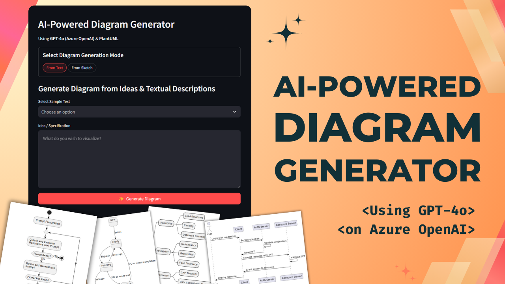

# AI-Powered Diagram Generator

This **AI-Powered Diagram Generator** leverages GPT-4o (hosted on Azure OpenAI) and PlantUML to convert textual descriptions and hand-drawn sketches into professional diagrams. This tool is designed to help visualize complex ideas and processes effortlessly.

Check out the demo 👇🏼

[](https://youtu.be/mK-5ExyDXUo)

## Features
  - Generate diagrams from textual descriptions.
  - Convert hand-drawn sketches into digital diagrams.
  - Download diagrams in SVG and PNG formats.
  - View detailed explanations and PlantUML syntax of generated diagrams.
  - Convert the PlantUML syntax to any other diagramming language (GraphViz, Mermaid, etc.)

## Setup

### Prerequisites
- Python 3.10 or higher
- Poetry [[Installation Instructions]](https://python-poetry.org/docs/#installation)
- Setup your GPT Model on Azure OpenAI [[Reference Video]](https://youtu.be/H_1Ge6wxaaE?si=_mv-I8w2VB7D1PhB)

### Usage
  1. Clone the repository.
  2. Install dependencies using Poetry:
     ```sh
     poetry install
     ```
  3. Set up your environment variables in `.env` file.
  4. Run the Streamlit app:
     ```sh
     streamlit run diagram-generator/app.py
     ```