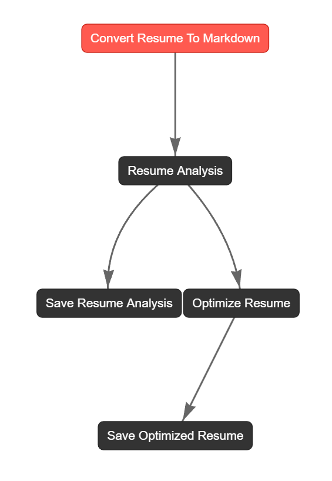

# Job Description-Based Resume Optimizer - Agentic Workflow (using CrewAI)

The Job Description-Based Resume Optimizer is an innovative project designed to help job seekers tailor their resumes to specific job descriptions using advanced AI techniques. 

By leveraging an agentic workflow comprising multi-agent system, this project ensures that resumes are optimized for Applicant Tracking Systems (ATS) and aligned with job requirements, enhancing the chances of landing an interview.

Currently, it uses:
- **Crew AI** for Multi-Agent workflow
- **GPT-4o** on **Azure OpenAI** (as LLM backbone for agents)

_**Note:** One can use any LLM of their choice by making a minor change in the `src/resume_optimizer_crew/crew.py` file_

## Features

- **Detailed Analysis:** Provides a thorough analysis of both the resume and the job description to identify strengths, weaknesses, and areas for improvement.
- **ATS Optimization:** Ensures that resumes are optimized for Applicant Tracking Systems by incorporating relevant keywords and phrases.

## CrewAI Flow for Resume Optimization

This is what the overall workflow looks like:




This workflow involves CrewAI agents in 2 steps:

- **Resume Analysis:** Using `resume_analyzer` agent
- **Optimize Resume:** Using `job_description_analyzer` & `alignment_specialist` agents

The detailed implementation can currently be found in the [`analysis.ipynb` Notebook](./src/analysis.ipynb)

## GUI Tool

I've also created an intuitive `streamlit` application to allow users to seamlessly optimize their resume w.r.t. any job application.

### Functionality
- **Job Description Input:** Users can paste the job description directly into a text area.
- **Resume Upload:** Supports uploading resumes in PDF and DOCX formats.
- **Resume Analysis & Optimization:** A single click to optimize the resume based on the provided job description.

The original & optimized versions are displayed side-by-side for comparison.

The optimized resume (markdown format) can also be downloaded.

### Setup

#### Prerequisites
- Python 3.10 or higher
- Poetry [[Installation Instructions]](https://python-poetry.org/docs/#installation)
- Setup your GPT Model on Azure OpenAI [[Reference Video]](https://youtu.be/H_1Ge6wxaaE?si=_mv-I8w2VB7D1PhB)

#### Usage
1. Clone the repository & get into the project directory
    ```sh
    git clone https://github.com/tezansahu/ai-garage.git
    cd ai-garage
    ```
2. Install dependencies using Poetry:
    ```sh
    poetry shell
    poetry install
    ```
3. `cd job-description-based-resume-optimizer/src`
4. Set up your environment variables in `.env` file.
5. Run the Streamlit app:
    ```sh
    streamlit run app.py
    ```

