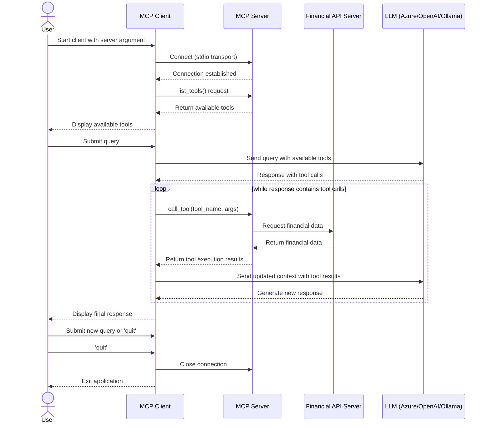

# AI Agent using Model Context Protocol (MCP)

## Introduction
This project implements an AI agent using the **Model Context Protocol (MCP)** architecture, providing a flexible interface for LLM-powered interactions with various data sources. 

It consists of an MCP Client with a command-line interface that can connect to different MCP Servers, including a **Financial Data Server** leveraging the Financial Modeling Prep (FMP) API to help answer users' questions.

## What is MCP?
The Model Context Protocol (MCP) is a specification for communication between large language models (LLMs) and external tools/services. Developed by Microsoft Research, MCP addresses several critical challenges in AI agent development:

### Why MCP Matters
- **Standardized Tool Calling:** MCP provides a consistent interface for LLMs to interact with tools, reducing implementation complexity.
- **Language/Framework Agnostic:** Works across different programming languages and frameworks, enabling interoperability.
- **Separation of Concerns:** Cleanly separates the LLM's reasoning capabilities from the execution of tools.
- **Enhanced Security:** By establishing boundaries between the LLM and tool execution environments, MCP improves security and control.
- **Simplified Development:** Developers can focus on creating the tool functionality without worrying about LLM integration details.

## Project Architecture

This project implements the MCP architecture in the following manner:



### Components

- **MCP Client:** Command-line interface that handles user queries, connects to MCP servers, and processes LLM responses.
- **MCP Servers:** Specialized servers that expose domain-specific tools via the MCP protocol.
    - **Currently implemented:** Financial Data Server using Financial Modeling Prep API
- **LLM Integration:** Supports multiple LLM providers (Azure OpenAI, OpenAI, Ollama) for processing queries and tool calls.

## Implemented Features

### MCP Client
- Command-line interface for user interactions
- Support for multiple LLM providers (Azure OpenAI, OpenAI, Ollama)
- Provides tools for accessing financial data via the Financial Modeling Prep API:

### Financial Data MCP Server
Provides tools for accessing financial data via the Financial Modeling Prep API:
- Company profiles
- Balance sheets
- Cash flow statements
- Key financial metrics
- Financial ratios
- Real-time stock quotes

## Setup & Usage

### Prerequisites

Before using this AI agent, ensure you have the following:

- Python 3.8 or higher
- `uv` package installer, recommended for Python project management ([Reference](https://docs.astral.sh/uv/#installation))
- Access to one of the supported LLM providers:
    - Azure OpenAI [[Reference Video]](https://youtu.be/H_1Ge6wxaaE?si=_mv-I8w2VB7D1PhB)
    - OpenAI
    - Ollama (with a model that supports tool calling)

### Installation

1. Clone the repository & get into the project directory
    ```sh
    git clone https://github.com/yourusername/ai-garage.git
    cd ai-garage/mcp-agent
    ```

2. Create and activate a virtual environment using `uv`:
    ```sh
    uv venv
    # On Windows
    .\.venv\Scripts\activate
    # On macOS/Linux
    source .venv/bin/activate
    ```
3. Install all dependencies
    ```sh
    uv sync
    ```
4. Set up environment variables by creating `.env` files as follows:
    - In `mcp_client/.env`:
        ```
        # For Azure OpenAI
        AZURE_API_KEY=your_azure_api_key
        AZURE_API_BASE=your_azure_endpoint
        AZURE_API_VERSION=your_api_version
        AZURE_API_DEPLOYMENT_NAME=your_deployment_name

        # For OpenAI
        OPENAI_API_KEY=your_openai_api_key
        ```
    - In `financial_data_mcp_server/.env`:
        ```
        FINANCIAL_MODELING_PREP_API_KEY=your_fmp_api_key
        ```

### Usage

- `cd mcp_client` & start the MCP client, specifying the path to the MCP server script:
    ```sh
    python mcp_client.py --server financial_data
    ```
    - If you wish to run using a different model provider, use the syntax:
        ```sh
        python mcp_client.py --server financial_data --llm-provider ollama --model qwen2.5:7b
        ```
- Once connected, you'll see a list of available tools.
- Type your queries about financial data, for example:
    - "What is the current stock price of Microsoft?"
    - "Show me Apple's balance sheet for the last 3 years."
    - "Compare financial ratios between Tesla and Ford."
- Type `quit` to exit the chat loop.

> [Optional] Feel free to comment out line number 534 (`logger.info(f"Processing request of type {type(req).__name__}")`) in `.venv/Lib/site-packages/mcp/server/lowlevel/server.py`

#### LLM Provider Configurations

The client supports different LLM providers:
- Azure OpenAI (default)
- OpenAI
- Ollama (for local models)

