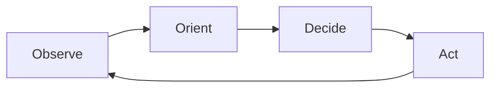

# Insights Output Format

## File Structure

Every insights file follows this structure:

```markdown
# [Resource Title]

> **Source:** [URL or absolute/relative file path] \
> **Type:** YouTube Video | Blog Post | Research Paper | [Other] \
> **Extracted:** [YYYY-MM-DD] \
> **Original length:** ~X min watch / ~Y min read / Z pages

---

## TL;DR
[2-4 sentences capturing the single most important idea from this resource.
If someone reads nothing else, what must they know?]

---

## Key Insights

### [Insight category sections — see below]

---

## Diagrams & Mental Models
[Only include if a diagram genuinely clarifies something better than text]

---

## Worth Revisiting
[2-4 direct quotes or specific data points worth coming back to]
```

---

## Insight Categories

Include only the categories where you actually found material. Skip empty ones entirely. Use nested bullets for sub-points; keep each bullet to 1-2 sentences max.

### Frameworks & Mental Models
Conceptual structures, named models, decision trees, or systematic ways of thinking introduced in the resource.

- **[Framework name]**: What it is and why it matters
  - Sub-point if needed

### Quotes & Maxims
Exact quotes or paraphrased maxims that are pithy, memorable, or hit differently. Cite speaker/author.

- _"Exact quote here"_ — Speaker Name
- Paraphrase of memorable line (attributed)

### Trends, Ideas & Opportunities
Emerging patterns, predictions, or spaces the author identifies as important or underexplored.

- **[Trend name]**: Description + why now

### Counter-Intuitive Insights
Things that challenge conventional wisdom or surprised you.

- **[Topic]**: Common belief vs. what the resource argues

### Tools & Resources
Specific tools, papers, books, datasets, websites, or services mentioned and recommended.

- **[Name]** — [what it does / why recommended] — [link if available]

### Key Takeaways
The most actionable insights — things you could actually do differently tomorrow.

- [Specific, concrete action or mindset shift]

---

## When to Include Diagrams

Include a Mermaid or ASCII diagram when:
- A framework has distinct stages or a flow (use Mermaid flowchart)
- There's a hierarchy or taxonomy (use Mermaid graph or ASCII tree)
- Two concepts are being compared structurally (use ASCII side-by-side)
- A timeline or sequence matters (use Mermaid sequence or timeline)

**Mermaid example (framework flow):**


**ASCII example (2x2 matrix):**
```
              HIGH IMPACT
                   |
    Quick Wins     |   Major Projects
    (do first)     |   (schedule)
                   |
  ─────────────────+─────────────────
                   |
    Fill-ins       |   Thankless Tasks
    (batch/defer)  |   (eliminate)
                   |
              LOW IMPACT
         LOW EFFORT      HIGH EFFORT
```

Use diagrams sparingly — only when they compress understanding significantly.

---

## File Naming Convention

Slugify the resource title: lowercase, hyphens for spaces, no special chars.

Examples:
- "The Lean Startup" → `the-lean-startup.md`
- "How to Get Rich (without getting lucky)" → `how-to-get-rich.md`
- "Attention Is All You Need" → `attention-is-all-you-need.md`
- YouTube video titled "Y Combinator's Advice for 2024" → `yc-advice-2024.md`

All files go in `knowledge/insights/` at the workspace root.

---

## Quality Bar

- Every bullet should be something you'd actually want to remember or act on
- Avoid restating what the resource says — extract the *implication* or *why it matters*
- If a section would have only one generic bullet, skip the section
- Aim for 400–900 words total in the insights file (longer for dense research papers, shorter for focused blog posts)
- Diagrams only where they genuinely compress understanding
