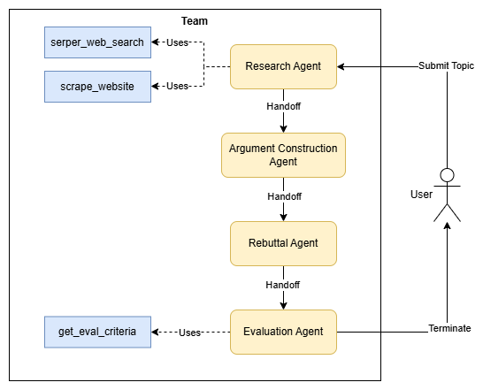

# Multi-Agent Debate (Autogen Swarm + Chainlit)

A sophisticated debate system using multiple AI agents in a swarm configuration to research, construct arguments, provide rebuttals, and evaluate debates on any topic.

## Overview
This project demonstrates an advanced approach to collaborative AI reasoning through structured debate. The system uses a team of specialized agents that work together with distinct roles:

- **Research Agent:** Gathers facts, statistics, and evidence from the web
- **Argument Construction Agent:** Builds logical, compelling arguments based on research
- **Rebuttal Agent:** Critically analyzes arguments and constructs counterpoints
- **Evaluation Agent:** Assesses the debate using predefined evaluation criteria

The agents collaborate in a swarm pattern powered by [AutoGen AgentChat](https://microsoft.github.io/autogen/stable/user-guide/agentchat-user-guide/index.html) and provide an interactive debate experience through a [Chainlit](https://docs.chainlit.io/get-started/overview) UI.

### What is "Swarm"?
Swarm is a multi-agent design pattern first introduced by OpenAI that implements a collaborative team where agents can hand off tasks to other agents based on their specialized capabilities. 

The key innovation is that agents can delegate tasks to other team members using special tool calls, while maintaining a shared message context across the entire team. This approach enables decentralized task planning through local decision-making by individual agents, eliminating the need for a central orchestrator to coordinate all activities.

## Features
- **Web Research:** Utilizes Serper API for Google search and web scraping to gather current information
- **Structured Debate Flow:** Agents communicate in sequence with defined handoffs between stages
- **Interactive UI:** Clean, user-friendly interface using Chainlit
- **Predefined Topics:** Includes starter topics for immediate engagement
- **Customizable Evaluation:** Uses predefined criteria for objective assessment


## Architecture



## Setup & Usage

### Prerequisites

Before using this AI agent, ensure you have the following:

- Python 3.8 or higher
- `uv` package installer, recommended for Python project management ([Reference](https://docs.astral.sh/uv/#installation))
- Access to one of the supported LLM providers:
    - Azure OpenAI [[Reference Video]](https://youtu.be/H_1Ge6wxaaE?si=_mv-I8w2VB7D1PhB)
    - OpenAI
- Create a FREE account on [Serper.dev](https://serper.dev/)

### Installation

1. Clone the repository & get into the project directory
    ```sh
    git clone https://github.com/tezansahu/ai-garage.git
    cd ai-garage/swarm-multiagent-debate-autogen-chainlit
    ```

2. Create and activate a virtual environment using `uv`:
    ```sh
    uv venv
    # On Windows
    .\.venv\Scripts\activate
    # On macOS/Linux
    source .venv/bin/activate
    ```
3. Install all dependencies
    ```sh
    uv sync
    ```
4. Create a `.env` file with your Serper API keys: `SERPER_API_KEY=<your-api-key>`
5. Configure your model settings in `model_config.yaml`

### Usage

Run the application:
```sh
chainlit run app.py
```

This will start the Chainlit server, allowing you to:

- Select a predefined debate topic or enter your own
- Watch as agents research, construct arguments, rebut, and evaluate
- Review the complete debate thread
